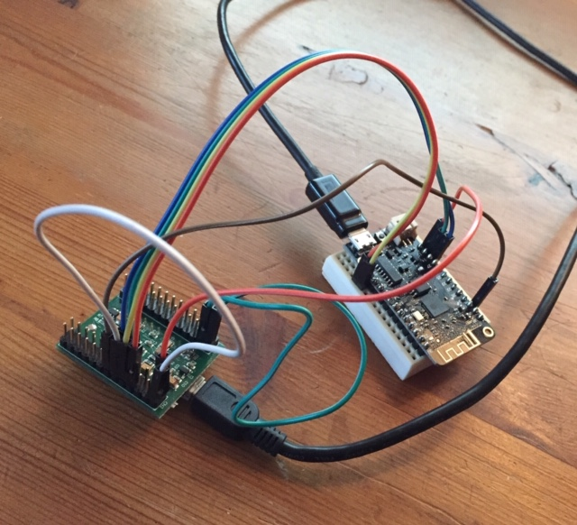

# Using an FT2232H minimodule to debug an ESP32 board

Here is a post from December 2019, on the PlatformIO community forum, <https://community.platformio.org/t/using-an-ft2232h-minimodule-to-debug-an-esp32-board/11162>.

## Post

It took me a very long time to get my setup working, so I thought I’d share what I found, in the hope it is helpful for others.

I have a Mac (OSX 10.13) with platformIO (in VSCode, but that doesn’t really matter), an ESP development board (Lolin32 lite, and that matters a little, see below) and an FT2232H Mini Module. Should be all fine for running the PlatformIO debugger, but unfortunately all the information you need is in different places, and with google you often find incorrect information.

The esp32 board you have matters, because you need to be able to access GPIO12, GPIO13, GPIO14 and GPIO15.

First thing to note is that the MiniModule has many options for where the FT2232H is powered from. If you don’t apply the correct power jumpers all sorts of weird things happen (mine sometimes showed up with a different VID and PID on the USB bus, or a different description, for example PID 6012 in stead of 6010 or description “ES001H” or “Dual RS-232-HS” in stead of “FT2232H MiniModule”.

Read the Mini Module datasheet, <https://www.ftdichip.com/Support/Documents/DataSheets/Modules/DS_FT2232H_Mini_Module.pdf>, especially the bit of section 3 on “USB Bus Powered”. And carefully check the layout of the connectors (CN1 and CN3) and their pin numbers.You need to add 2 jumpers to the minimodule:

- CN3 pin 1 to CN3 pin 3. This connects USB power to MiniModule VCC.
- CN2 pin 1 to CN2 pin 11 (but there are other options for this). This connects MiniModule 3.3V to the FT2232H I/O voltage.

Next issue was getting the Minimodule to work consistently on the Mac, because depending on the OSX version you have and drivers you may have installed previously there may be other USB drivers that recognize the minimodule and make it inaccessible to platformIO debugger.

You may have to remove `/Library/Extensions/FTDIUSBSerialDriver.kext`. Google for “uninstall mac ftdi driver” and see which of the procedures makes sense for you. If you connect the MiniModule and `ls -l /dev/tty.*` shows that a new serial port has appeared you have not fully removed all old drivers yet.

> User manuelbl made a very good suggestion: removing the drivers may not be the best solution, and may not even work. Disabling them temporarily while you are working with openOCD is better. Find out which driver is used and disable it with `kextunload`:
>

```
# FTDI user-space driver from Apple
sudo kextunload /System/Library/DriverExtensions/DriverKit.AppleUSBFTDI.dext
# FTDI user-space driver from Apple
sudo kextunload /System/Library/DriverExtensions/com.apple.DriverKit-AppleUSBFTDI.dext

# FTDI kernel driver from Apple
sudo kexunload /System/Library/Extensions/AppleUSBFTDI.kext

# FTDI kernel driver from FTDI
sudo kextunload /Library/Extensions/FTDIUSBSerialDriver.kext
```

If everything is fine at this point you should see the MiniModule if you go to _Apple Menu → About this Mac → System Report → USB_. It should be listed as “FT2232H MiniModule”, product ID 0x6010, vendor ID 0x0403.

Now you have to work out how to connect the MiniModule to your esp32 board. You need to connect GND (signal ground), EN (Enable, which is actually RESET but active low) and the 4 JTAG signals TCK, TDI, TDO and TMS:

- GND is easy: connect Minimodule pin CN2-2 to a ground pin on your esp32 board.
- EN should be easy to find on your esp32 board, but it may be called RST' or something like that. Finding the right MiniModule pin to connect this to may be more work, and the suggestions that google turns up and in the PlatformIO documentation are misleading. Check the openocd minimodule config file (which is somewhere like `.platformio/packages/tool-openocd-esp32/share/openocd/scripts/interface/ftdi/minimodule.cfg`. You’re looking for signal nSRST. On my version of platformio/openocd it was connected to FT2232H AD5, which is MiniModule pin CN2-13.
- MiniModule CN2-7 goes to GPIO13 (JTAG name TCK, FT2232H pin AD0)
- MiniModule CN2-10 goes to GPIO12 (JTAG name TDI, FT2232H pin AD1)
- MiniModule CN2-9 goes to GPIO15 (JTAG name TDO, FT2232H pin AD2)
- MiniModule CN2-12 goes to GPIO14 (JTAG name TMS, FT2232H pin AD3)

And here is a picture (if won’t win any prizes, but it may help someone to find out how to route the signals): 

